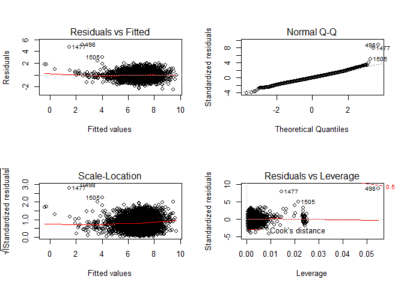
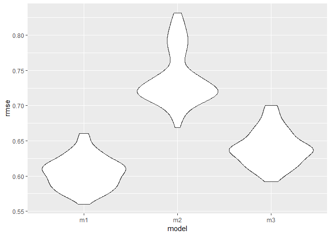

p8105\_hw6\_ml4239
================
Man Luo
2018/11/7

------------------------------------------------------------------------

P.1
---

### tidy the data.

``` r
homicide_data <- read_csv('./data/homicide-data.csv') 


homicide_tidy<-homicide_data %>% 
  mutate(city_state = str_c(city, ",", state),
         case_status = ifelse(disposition == "Closed without arrest" | disposition == "Open/No arrest", 0, 1)) %>%
  filter(victim_race != "Unknown") %>% 
   mutate(victim_race = ifelse(victim_race == "White", "White", "Nonwhite"),
          victim_race = factor(victim_race, levels = c("White", "Nonwhite")),
          victim_age = as.numeric(victim_age))%>% 
  filter(!(city_state %in% c('Dallas,TX', 'Phoenix,AZ','Kansas City,MO',"Tulsa,AL"))) %>% 
  na.omit(victim_age)
```

    ## Warning in evalq(as.numeric(victim_age), <environment>): NAs introduced by
    ## coercion

Create a city\_state variable and a binary variable indicating the case status (if it is solved or not). factorized victim\_race variable and making sure victim\_age variables are all numeric.

### regression fpr the city of Baltimore, MD

``` r
baltimore <-homicide_tidy %>% 
  filter(city_state == "Baltimore,MD")

fit_logistic = 
  baltimore %>% 
  glm(case_status ~ victim_age + victim_race + victim_sex, data = ., family = binomial())  #Save the output of glm as an R object
```

Obtain the estimate and confidence interval of the adjusted odds ratio for solving homicides comparing non-white victims to white victims keeping all other variables fixed.

``` r
fit_logistic %>% 
  broom::tidy() %>% 
  mutate(OR = exp(estimate),
         conf.low = exp(estimate - std.error*1.96),
         conf.high = exp(estimate + std.error*1.96)) %>% 
  select(term, OR, conf.low, conf.high, p.value) %>% 
  knitr::kable()
```

| term                 |         OR|   conf.low|  conf.high|    p.value|
|:---------------------|----------:|----------:|----------:|----------:|
| (Intercept)          |  3.2740589|  2.0671700|  5.1855735|  0.0000004|
| victim\_age          |  0.9930344|  0.9867043|  0.9994050|  0.0321594|
| victim\_raceNonwhite |  0.4406080|  0.3129079|  0.6204234|  0.0000027|
| victim\_sexMale      |  0.4115656|  0.3152280|  0.5373452|  0.0000000|

Here we can see the estimate of the adjusted odds ratio for solving homicides comparing non-white is 0.4406080, and 95% confidence interval is (0.3129079, 0.6204234)

### dataframe with estimated ORs and CIs for each city.

``` r
cities_summary <-homicide_tidy %>% 
  group_by(city_state) %>% 
  nest() %>% 
  mutate(models = map(data, ~glm(case_status ~ victim_age + victim_sex + victim_race, data = .x, family = binomial())),
         models = map(models, broom::tidy)) %>% 
  select(-data) %>% 
  unnest() %>% 
  filter(term == "victim_raceNonwhite") %>% 
  mutate(OR = exp(estimate),
         log_OR = estimate,
         conf.low = exp(estimate - std.error*1.96),
         conf.high = exp(estimate + std.error*1.96)) %>% 
  select(city_state, log_OR, OR, conf.low, conf.high, p.value)

cities_summary %>% 
  knitr::kable()
```

| city\_state       |     log\_OR|         OR|   conf.low|  conf.high|    p.value|
|:------------------|-----------:|----------:|----------:|----------:|----------:|
| Albuquerque,NM    |  -0.2702850|  0.7631620|  0.4601582|  1.2656869|  0.2950255|
| Atlanta,GA        |  -0.2839530|  0.7528020|  0.4315063|  1.3133316|  0.3172864|
| Baltimore,MD      |  -0.8195997|  0.4406080|  0.3129079|  0.6204234|  0.0000027|
| Baton Rouge,LA    |  -0.4040228|  0.6676289|  0.3127439|  1.4252185|  0.2963820|
| Birmingham,AL     |   0.0401607|  1.0409780|  0.6160137|  1.7591089|  0.8807377|
| Boston,MA         |  -2.1553095|  0.1158673|  0.0477626|  0.2810826|  0.0000019|
| Buffalo,NY        |  -0.9322715|  0.3936585|  0.2147486|  0.7216206|  0.0025682|
| Charlotte,NC      |  -0.5842897|  0.5575017|  0.3207914|  0.9688794|  0.0382543|
| Chicago,IL        |  -0.5761032|  0.5620844|  0.4311321|  0.7328123|  0.0000207|
| Cincinnati,OH     |  -1.1445849|  0.3183560|  0.1839996|  0.5508195|  0.0000428|
| Columbus,OH       |  -0.1538009|  0.8574427|  0.6351090|  1.1576092|  0.3152318|
| Denver,CO         |  -0.5076856|  0.6018870|  0.3589787|  1.0091626|  0.0541782|
| Detroit,MI        |  -0.4283278|  0.6515978|  0.4880433|  0.8699630|  0.0036762|
| Durham,NC         |   0.0028136|  1.0028175|  0.4041085|  2.4885469|  0.9951589|
| Fort Worth,TX     |  -0.1769334|  0.8378356|  0.5545077|  1.2659311|  0.4007906|
| Fresno,CA         |  -0.7957386|  0.4512478|  0.2318934|  0.8780956|  0.0191431|
| Houston,TX        |  -0.1306424|  0.8775316|  0.7019882|  1.0969723|  0.2512838|
| Indianapolis,IN   |  -0.6840764|  0.5045560|  0.3817941|  0.6667908|  0.0000015|
| Jacksonville,FL   |  -0.4182842|  0.6581751|  0.5023197|  0.8623880|  0.0024149|
| Las Vegas,NV      |  -0.2603831|  0.7707562|  0.5978050|  0.9937441|  0.0446002|
| Long Beach,CA     |  -0.2307939|  0.7939031|  0.3876546|  1.6258857|  0.5280169|
| Los Angeles,CA    |  -0.4067023|  0.6658424|  0.4828459|  0.9181936|  0.0131181|
| Louisville,KY     |  -0.9445671|  0.3888479|  0.2568463|  0.5886892|  0.0000080|
| Memphis,TN        |  -0.2508184|  0.7781637|  0.5209350|  1.1624074|  0.2205777|
| Miami,FL          |  -0.5503988|  0.5767198|  0.3759677|  0.8846656|  0.0116895|
| Milwaukee,wI      |  -0.4582502|  0.6323892|  0.4033912|  0.9913854|  0.0457473|
| Minneapolis,MN    |  -0.4374158|  0.6457029|  0.3447349|  1.2094287|  0.1718976|
| Nashville,TN      |  -0.0883292|  0.9154595|  0.6638130|  1.2625034|  0.5901516|
| New Orleans,LA    |  -0.7618302|  0.4668113|  0.2952950|  0.7379496|  0.0011118|
| New York,NY       |  -0.7004734|  0.4963503|  0.2568046|  0.9593427|  0.0372096|
| Oakland,CA        |  -1.5465668|  0.2129779|  0.1043603|  0.4346441|  0.0000214|
| Oklahoma City,OK  |  -0.3838211|  0.6812533|  0.4780242|  0.9708841|  0.0337141|
| Omaha,NE          |  -1.7714047|  0.1700939|  0.0941936|  0.3071540|  0.0000000|
| Philadelphia,PA   |  -0.4373360|  0.6457544|  0.4876646|  0.8550934|  0.0022677|
| Pittsburgh,PA     |  -1.2674074|  0.2815606|  0.1607457|  0.4931788|  0.0000093|
| Richmond,VA       |  -0.8042697|  0.4474146|  0.1616764|  1.2381510|  0.1214623|
| San Antonio,TX    |  -0.3668917|  0.6928847|  0.4636860|  1.0353755|  0.0733964|
| Sacramento,CA     |  -0.2552940|  0.7746887|  0.4451765|  1.3481003|  0.3664082|
| Savannah,GA       |  -0.5025401|  0.6049920|  0.2840923|  1.2883672|  0.1925656|
| San Bernardino,CA |  -0.1276678|  0.8801457|  0.3928312|  1.9719832|  0.7564200|
| San Diego,CA      |  -0.7515045|  0.4716564|  0.2896294|  0.7680843|  0.0025235|
| San Francisco,CA  |  -0.7802724|  0.4582812|  0.2904504|  0.7230896|  0.0007982|
| St. Louis,MO      |  -0.5488333|  0.5776234|  0.4062889|  0.8212106|  0.0022339|
| Stockton,CA       |  -0.9657909|  0.3806820|  0.1989413|  0.7284499|  0.0035350|
| Tampa,FL          |   0.1474076|  1.1588262|  0.5870394|  2.2875435|  0.6709560|
| Tulsa,OK          |  -0.5183504|  0.5955021|  0.4080809|  0.8690009|  0.0071844|
| Washington,DC     |  -0.6731847|  0.5100815|  0.2577041|  1.0096200|  0.0532959|

Get estimated ORs and CIs for each of the city in hte data set and create a table.

### plot that shows the estimated ORs and CIs for each city.

``` r
cities_summary %>% 
  ggplot(aes(x = reorder(city_state, OR), y = OR)) +
  geom_point() +
  geom_errorbar(aes(ymin = conf.low, ymax = conf.high)) +
  labs(title = "Estimated ORs and CIs for Each City",
       x = "city", 
       y = "ORs and CIs for nonwhite victims comparing to white victims",
       caption = "Data from the Washington Post") + 
  theme(axis.text.x = element_text(angle = 90, hjust = 1))
```


**Comments** The estimated ORS range from 0.1 to 1.2. `Boston, MA` has the least odd ratio and `Tampa, FL` has the most odds ratio for solving homicides comparing non-white victims to white victims keeping all other variables fixed. And we can also conclude from the plot that there tend to be more unsolved cases for nonwhite compared to white victims.(Birmingha, AL/ Tampa, FL are the only two exceptions)

P.2
---

### Load and clean the data for regression analysis

``` r
birthweight<- read_csv("./data/birthweight.csv")
birth_tidy<-birthweight %>% 
  mutate(babysex = as.factor(recode(babysex, `1` = 0, `2` = 1)), # 0 represent male, 1 represents female
         frace = as.factor(frace), 
         mrace = as.factor(mrace),
         malform = as.factor(malform),
         bhead = as.numeric(bhead), 
         bwt = as.numeric(bwt * 0.00220462),
         mheight = as.numeric(mheight ))

table(is.na(birthweight))
```

    ## 
    ## FALSE 
    ## 86840

Change babysex, frace, mrace, malform to factor variable and we can see there is no missing data.

### Build up regression model

Test the normal distribution assumption for the outcome

``` r
birth_tidy %>% 
  ggplot(aes(x = bwt)) + 
  geom_bar()+
  labs(x = "birthweight",
       title = "Barplot of birthweight variable") 
```


We can tell that the birthweight outcome is like a Normal distribution so it follows the assumption.

``` r
select_result <- regsubsets(bwt ~ ., data = birthweight)
```

    ## Warning in leaps.setup(x, y, wt = wt, nbest = nbest, nvmax = nvmax,
    ## force.in = force.in, : 3 linear dependencies found

    ## Reordering variables and trying again:

``` r
md_sum<-summary(select_result)
md_sum
```

    ## Subset selection object
    ## Call: regsubsets.formula(bwt ~ ., data = birthweight)
    ## 19 Variables  (and intercept)
    ##          Forced in Forced out
    ## babysex      FALSE      FALSE
    ## bhead        FALSE      FALSE
    ## blength      FALSE      FALSE
    ## delwt        FALSE      FALSE
    ## fincome      FALSE      FALSE
    ## frace        FALSE      FALSE
    ## gaweeks      FALSE      FALSE
    ## malform      FALSE      FALSE
    ## menarche     FALSE      FALSE
    ## mheight      FALSE      FALSE
    ## momage       FALSE      FALSE
    ## mrace        FALSE      FALSE
    ## parity       FALSE      FALSE
    ## ppbmi        FALSE      FALSE
    ## ppwt         FALSE      FALSE
    ## smoken       FALSE      FALSE
    ## pnumlbw      FALSE      FALSE
    ## pnumsga      FALSE      FALSE
    ## wtgain       FALSE      FALSE
    ## 1 subsets of each size up to 9
    ## Selection Algorithm: exhaustive
    ##          babysex bhead blength delwt fincome frace gaweeks malform
    ## 1  ( 1 ) " "     "*"   " "     " "   " "     " "   " "     " "    
    ## 2  ( 1 ) " "     "*"   "*"     " "   " "     " "   " "     " "    
    ## 3  ( 1 ) " "     "*"   "*"     " "   " "     " "   " "     " "    
    ## 4  ( 1 ) " "     "*"   "*"     "*"   " "     " "   " "     " "    
    ## 5  ( 1 ) " "     "*"   "*"     "*"   " "     " "   "*"     " "    
    ## 6  ( 1 ) " "     "*"   "*"     "*"   " "     " "   "*"     " "    
    ## 7  ( 1 ) " "     "*"   "*"     "*"   " "     " "   "*"     " "    
    ## 8  ( 1 ) " "     "*"   "*"     "*"   "*"     " "   "*"     " "    
    ## 9  ( 1 ) "*"     "*"   "*"     "*"   "*"     " "   "*"     " "    
    ##          menarche mheight momage mrace parity pnumlbw pnumsga ppbmi ppwt
    ## 1  ( 1 ) " "      " "     " "    " "   " "    " "     " "     " "   " " 
    ## 2  ( 1 ) " "      " "     " "    " "   " "    " "     " "     " "   " " 
    ## 3  ( 1 ) " "      " "     " "    "*"   " "    " "     " "     " "   " " 
    ## 4  ( 1 ) " "      " "     " "    "*"   " "    " "     " "     " "   " " 
    ## 5  ( 1 ) " "      " "     " "    "*"   " "    " "     " "     " "   " " 
    ## 6  ( 1 ) " "      " "     " "    "*"   " "    " "     " "     " "   " " 
    ## 7  ( 1 ) " "      " "     " "    "*"   " "    " "     " "     "*"   " " 
    ## 8  ( 1 ) " "      " "     " "    "*"   " "    " "     " "     "*"   " " 
    ## 9  ( 1 ) " "      " "     " "    "*"   " "    " "     " "     "*"   " " 
    ##          smoken wtgain
    ## 1  ( 1 ) " "    " "   
    ## 2  ( 1 ) " "    " "   
    ## 3  ( 1 ) " "    " "   
    ## 4  ( 1 ) " "    " "   
    ## 5  ( 1 ) " "    " "   
    ## 6  ( 1 ) "*"    " "   
    ## 7  ( 1 ) "*"    " "   
    ## 8  ( 1 ) "*"    " "   
    ## 9  ( 1 ) "*"    " "

``` r
par(mar=c(4,4,1,1))
par(mfrow=c(1,2))
plot(2:10, md_sum$cp, xlab="No of parameters", ylab="Cp Statistic")
abline(0,1)
plot(2:10, md_sum$adjr2, xlab="No of parameters", ylab="Adj R2")
```


From the plot of CP statistics and Adjr2, we can tell there is no such different after 8 parameters, which are bhead, blength, delwt, fincome ,gaweeks, mrace, ppbmi, smoken.

Next we build the model and check its assumption.

``` r
multi.fit8<-lm(bwt ~ bhead+ blength + delwt + fincome + gaweeks + mrace  + ppbmi + smoken, data = birth_tidy)
par(mfrow=c(2,2))
plot(multi.fit8) #check assumption
```

 It fits the assumption quite nice. The residuals lies between 0 and QQ plot shows nice linear relationship which indicates it follows the normal distribution. \#\#\#Factor driven regression model

For factor regression we choose the variable "babysex " and "mrace".

Propose a regression model for birthweight. This model may be based on a hypothesized structure for the factors that underly birthweight, on a data-driven model-building process, or a combination of the two.

### show a plot of model residuals against fitted values

``` r
birth_tidy %>% 
  add_predictions(multi.fit8) %>% 
  add_residuals(multi.fit8) %>% 
  ggplot(aes(x = pred, y = resid)) + 
  geom_point() + 
  geom_smooth(se = FALSE) + 
  labs(x = "Predicted value", 
       y = "Residual",
       title = "Predicted values vs. residuals plot for Final model")
```

    ## `geom_smooth()` using method = 'gam' and formula 'y ~ s(x, bs = "cs")'


### Compare your model to two others:

One using length at birth and gestational age as predictors (main effects only) One using head circumference, length, sex, and all interactions (including the three-way interaction) between these

Make this comparison in terms of the cross-validated prediction error

``` r
cv = 
  crossv_mc(birth_tidy, 100) %>%
  mutate(train = map(train, as_tibble),
         test = map(test, as_tibble)) 
  
cv = 
    cv %>% 
  mutate(model_own = map(train, ~lm(bwt ~  bhead + blength + delwt + fincome + gaweeks + mrace  + ppbmi + smoken, data = .x)),
         model_main = map(train, ~lm(bwt ~ blength + gaweeks, data = .x)),
         model_inter = map(train, ~lm(bwt ~ babysex + blength + bhead + babysex * blength + babysex * bhead + blength * bhead + babysex * blength * bhead, data = .x))) %>% 
    mutate(rmse_m1 = map2_dbl(model_own, test, ~rmse(model = .x, data = .y)),
         rmse_m2 = map2_dbl(model_main, test, ~rmse(model = .x, data = .y)),
         rmse_m3 = map2_dbl(model_inter, test, ~rmse(model = .x, data = .y)))
  
  
cv %>% 
  select(starts_with("rmse")) %>% 
  gather(key = model, value = rmse) %>% 
  mutate(model = str_replace(model, "rmse_", ""),
         model = fct_inorder(model)) %>% 
  ggplot(aes(x = model, y = rmse)) + geom_violin()
```

 We can tell from the plot that m1 model (our model) has thee smallest rmse while the 'main effets only' model has the highest rmse.
